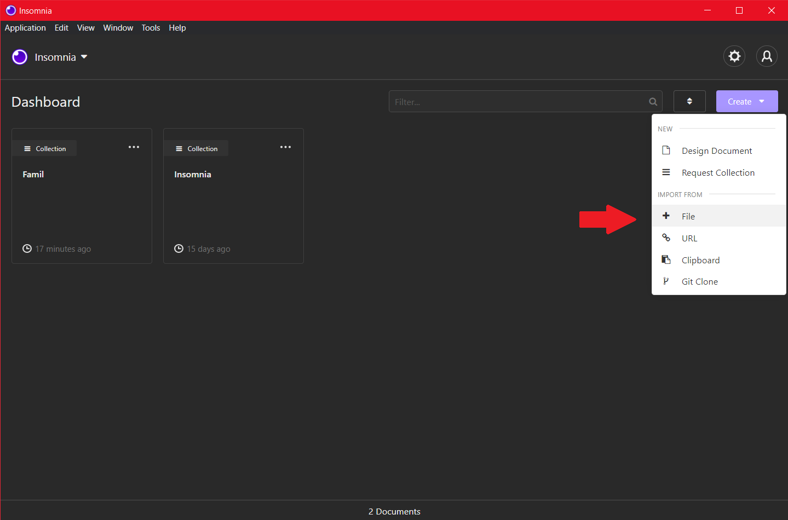
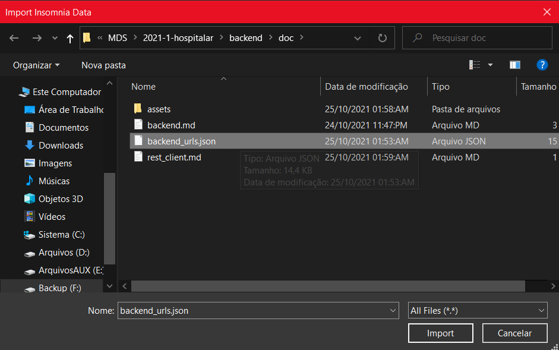
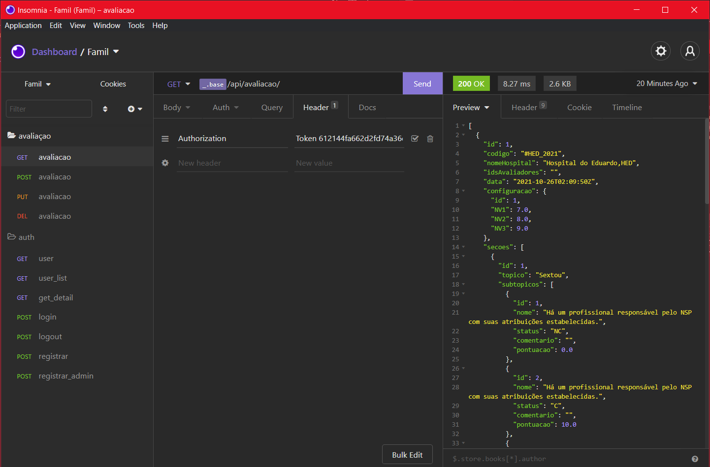

# Pequeno tutorial para utilizar a ferramenta Rest Client Insomnia

- Instale o app: [link](https://insomnia.rest/download)
- Ao abrir o app, importe o template de requisições:

- O template se encontra em backend/docs/backend_urls.json

- Selecione as requisições na esquerda e envie pelo botão roxo send

- Repare que algumas requisições precisam que um usuário esteja logado, para fazer isso execute a requisição login e copie o "token" retornado

- Na aba Header da requisição é necessário que o campo Authorization exista e esteja ativado, cole o token copiado logo depois da palavra Token e a requisição funcionará sem problemas.
