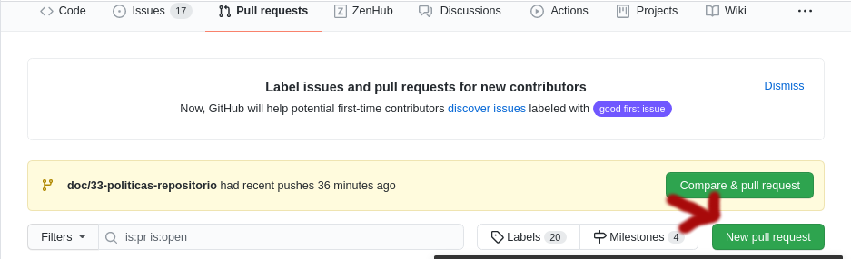

# Workflow

##Introdução
Para que os colaboradores possam contribuir de forma eficaz, recomendamos esse workflow para diminuir os riscos de conflitos.

**Os passos são os seguintes:** 
1. Crie uma branch para a issue/funcionalidade, seguindo as [políticas](policies.md)
2. Faça um push da sua branch para o GitHub:
	```
	git push origin nome-da-branch-criada
	```
3. Adicione e faça [commit](policies.md) de seus arquivos no repositório local, seguindo as políticas
4. Dê, novamente, um push para a branch criada
5. Faça um rebase para identificar conflitos antes do Pull Request:
`git rebase main`
6. Após testes, faça um Pull Request, linkando com a issue:
	- No repositório, clique em Pull request:
	
	- Verifique a branch de origem e de destino.
	- Preencha o template (remova as partes não necessárias para o seu PR):
```markdown
		# Description

Please include a summary of the change and which issue is fixed. Please also include relevant motivation and context. List any dependencies that are required for this change.

Fixes # (issue)

## Type of change

Please delete options that are not relevant.

- [ ] Bug fix (non-breaking change which fixes an issue)
- [ ] New feature (non-breaking change which adds functionality)
- [ ] Breaking change (fix or feature that would cause existing functionality to not work as expected)
- [ ] This change requires a documentation update

# How Has This Been Tested?

Please describe the tests that you ran to verify your changes. Provide instructions so we can reproduce. Please also list any relevant details for your test configuration

- [ ] Test A
- [ ] Test B

**Test Configuration**:
* Firmware version:
* Hardware:
* Toolchain:
* SDK:

# Checklist:

- [ ] My code follows the style guidelines of this project
- [ ] I have performed a self-review of my own code
- [ ] I have commented my code, particularly in hard-to-understand areas
- [ ] I have made corresponding changes to the documentation
- [ ] My changes generate no new warnings
- [ ] I have added tests that prove my fix is effective or that my feature works
- [ ] New and existing unit tests pass locally with my changes
- [ ] Any dependent changes have been merged and published in downstream modules
```
- Crie seu Pull Request
- Volte aos Pull Requests. Na sidebar à direita, clique em Linked Issues:
  
- Clique na issue relacionada.
