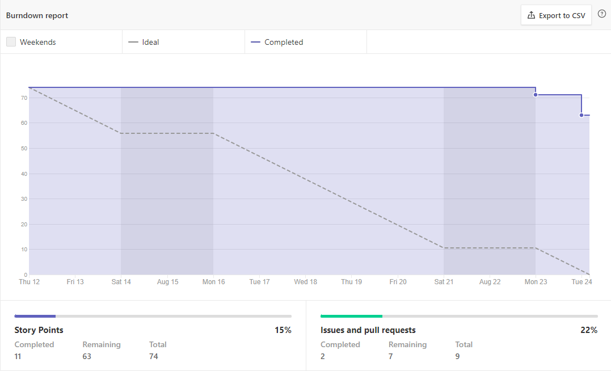
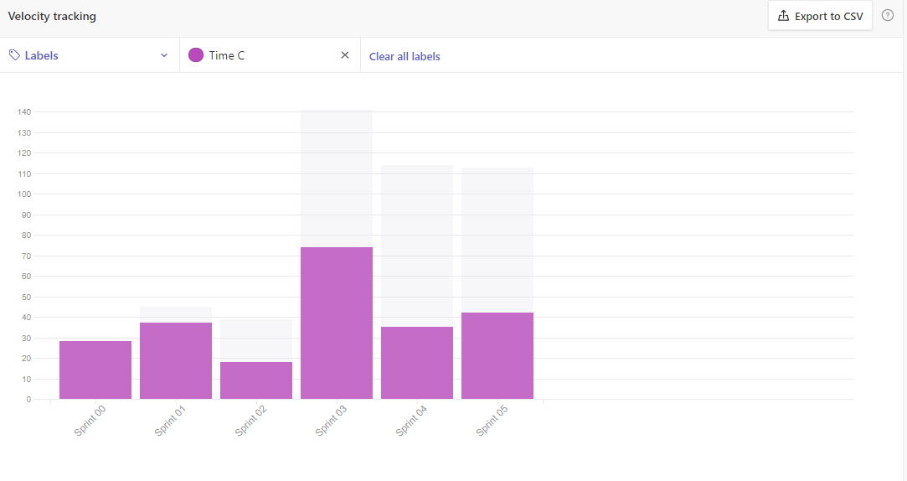

# Fechamento da Sprint (nº)

## Histórico de revisão

| **Data** |  **Versão** | **Modificação**  |  **Autor** |
|:-:|:-:|:-:|:-:|
|    11/09/2021   |  0.1 | Criação do documento  | Pedro Vieira / Pedro Caldeira |

## Backlog da Sprint 

| **ID** |  **Descrição** | **Status**  |  **Pontos** |
|:-:|:-:|:-:|:-:|
|    #16   |  [Criar protótipo de baixa fidelidade](https://github.com/fga-eps-mds/2021-1-hospitalar/issues/16) | fechada  | 13 |
|    #19   |  [Início do Product Backlog](https://github.com/fga-eps-mds/2021-1-hospitalar/issues/19)| fechada  | 8 |
|    #20   |  [Elaboração do RoadMap](https://github.com/fga-eps-mds/2021-1-hospitalar/issues/20)| aberta  | 8 |
|    #21   |  [Elaboração do EAP](https://github.com/fga-eps-mds/2021-1-hospitalar/issues/21) | fechada  | 5 |
|    #22   |  [Elaboração do Documento de Visão](https://github.com/fga-eps-mds/2021-1-hospitalar/issues/22) | fechada  | 2 |
|    #23   |  [Reunião inicial quanto a Modelagem do Banco de Dados](https://github.com/fga-eps-mds/2021-1-hospitalar/issues/23) | aberta  |  |
|    #24   |  [Abertura do Documento de Arquitetura](https://github.com/fga-eps-mds/2021-1-hospitalar/issues/24) | fechada  | ... |
|    #25   |  [#25 Estudos da Linguagem JavaScript](https://github.com/fga-eps-mds/2021-1-hospitalar/issues/25) | aberta  | ... |
|    #26   |  [Organizar o ZenHub](https://github.com/fga-eps-mds/2021-1-hospitalar/issues/26) | fechada  | ... |
|    #31   |  [Atualizar arquivo README](https://github.com/fga-eps-mds/2021-1-hospitalar/issues/31) | fechada  | ... |
|    #47   |  [Elaboração do Diagrama de Classes](https://github.com/fga-eps-mds/2021-1-hospitalar/issues/47) | fechada  | ... |
|    #56   |  [Redação do Documento de Arquitetura](https://github.com/fga-eps-mds/2021-1-hospitalar/issues/56) | fechada  | ... |

## Pontuação Final

**Pontuação Total:** (nº) Pontos Planejados  
**Débitos Técnicos Adicionados:** (nº) Pontos  
**Pontos Concluídos:** (nº) Pontos Concluídos  

## Débitos Técnicos de Sprints Anteriores

- Não houveram débitos técnicos para pagar nesta sprint

OU

#(nº) nome da issue 
  
#(nº) nome da issue 

## Débitos Técnicos Gerados

- Não foram gerados débitos nesta sprint

OU

#(nº) nome da issue 
  
#(nº) nome da issue 

## Retrospectiva

### Pontos Positivos

-
-

### Pontos Negativos

-
-

### Melhorias

-
-

## Burndown

  
## Velocity

  
  
## Práticas ágeis
  
|ID    | Nome de prática ágil    | Sprint nº |
| :-: | :-: | :-: |
| 1    | Priorização do Backlog pelo PO | &#10004; |
| 2    | Desenvolvimento de processos e práticas facilitadas pelo SM | &#10004; |
| 3    | Reunião de planejamento de Sprint | &#10004; |
| 4    | Planning Poker | &#10060; |
| 5    | Comprometimento do time e do PO com o backlog do produto | &#10060; |
| 6    | Os membros da equipe são voluntários para tarefas | &#10004; |
| 7    | Restrospectiva da Sprint | &#10004; |
| 8    | Acompanhamento do Velocity | &#10060; |
| 9    | User Stories | &#10060; |
| 10 |    Refatorar quando e onde for possível | &#10004; |
| 11 | Todo código deve ter códigos unitários | &#10060; |
| 12 |    Todo código deve passar por testes unitários antes de ser liberado | &#10060; |
| 13 |     Acompanhamento do Squad Health Check | &#10004; |
| 14 |    Quadro de conhecimentos| &#10004; |
  
## Quadro de Conhecimento

| Nome | Github | HTML | Javascript | Metodologia ágeis | Docker | Django | Mongodb |
| :-: | :-: | :-: | :-: | :-: | :-: | :-: | :-: |
| Pedro Caldeira | &#128999; | &#128997; | &#129000; | &#129000; | &#129000; | &#129000; | &#128997; | 
| Pedro Vieira | &#129001; | &#129001; | &#128998; | &#129000; | &#129000; | &#128997;| &#129001; | 
| Gabriel Luiz | &#129001; | &#128997; | &#129000; | &#129000; | &#128997; | &#129000; | &#129000; | 
| Igor Thiago | &#128999; | &#128997; | &#128997; | &#129000; | &#129000; | &#128997; | &#128997; | 
| Thiago Vivan | &#128999; | &#128997; | &#128997; | &#129000; | &#128997; | &#128997; | &#128997; | 
| Bruno | &#128999; | &#129000; | &#128997; | &#129000; | &#128997; | &#128997; | &#128997; | 

| Cor | Legenda |
| :-: | :-: |
| &#128998; | Sou brabo |
| &#129001;| Consigo me virar |
| &#128999; | Sei mais ou menos|
| &#129000;  | Então... |
| &#128997; | Socorro!|
  

## Riscos

|  **Risco**  | **Ação Preventiva** |	**Ação Reativa** |
|:-:|:-:|:-:|
| Desmotivação para o trabalho | ... | ... |
| Não utilizar práticas ágeis | ... | ... |
| Muitas tarefas durante a semana |:-:|:-:|
| Falta de conhecimento sobre as tecnologias |:-:|:-:|
|:-:|:-:|:-:|
|:-:|:-:|:-:|

## Análise pelo Scrum Master